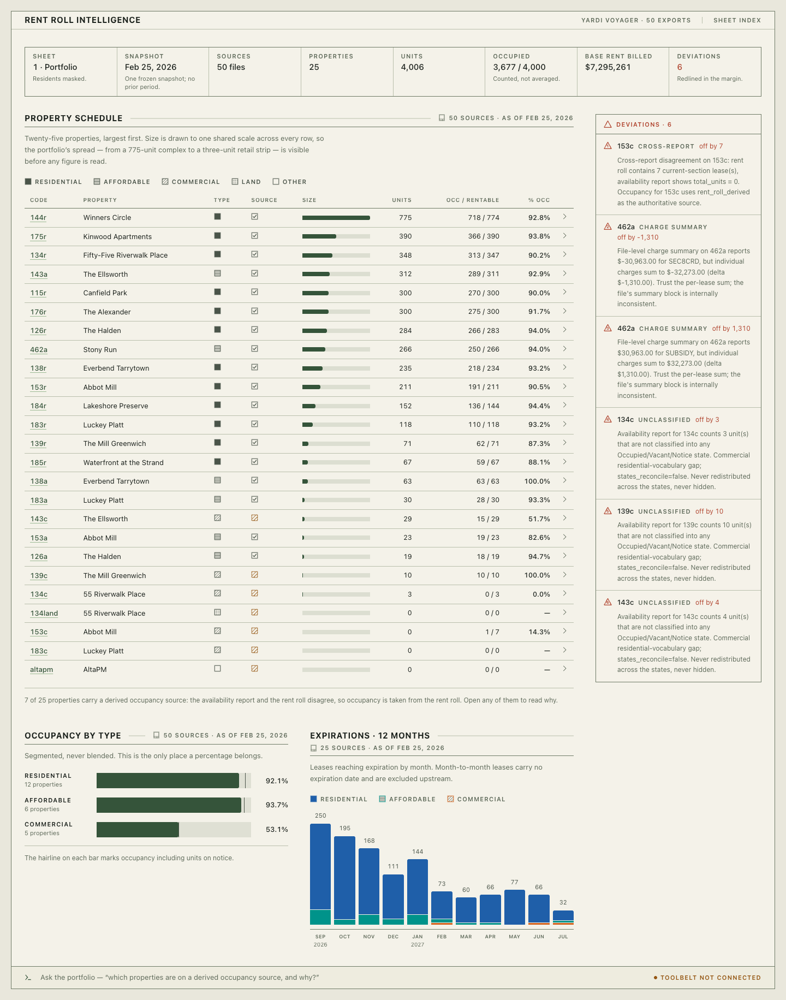
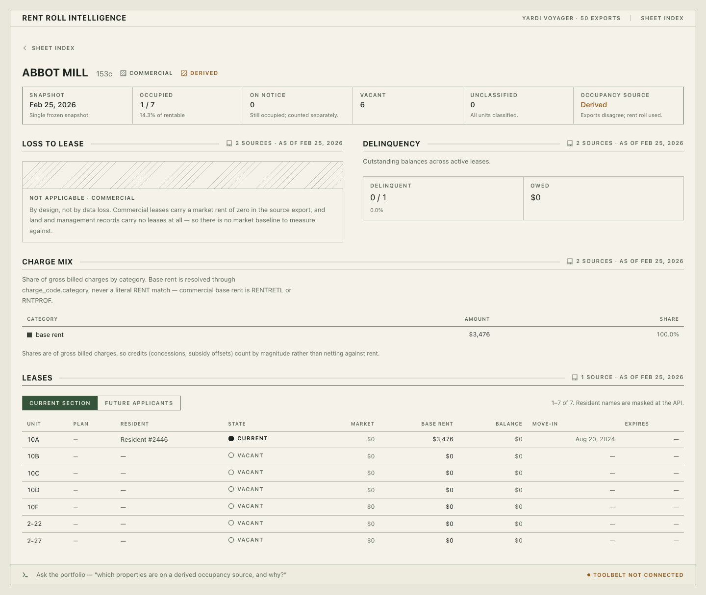
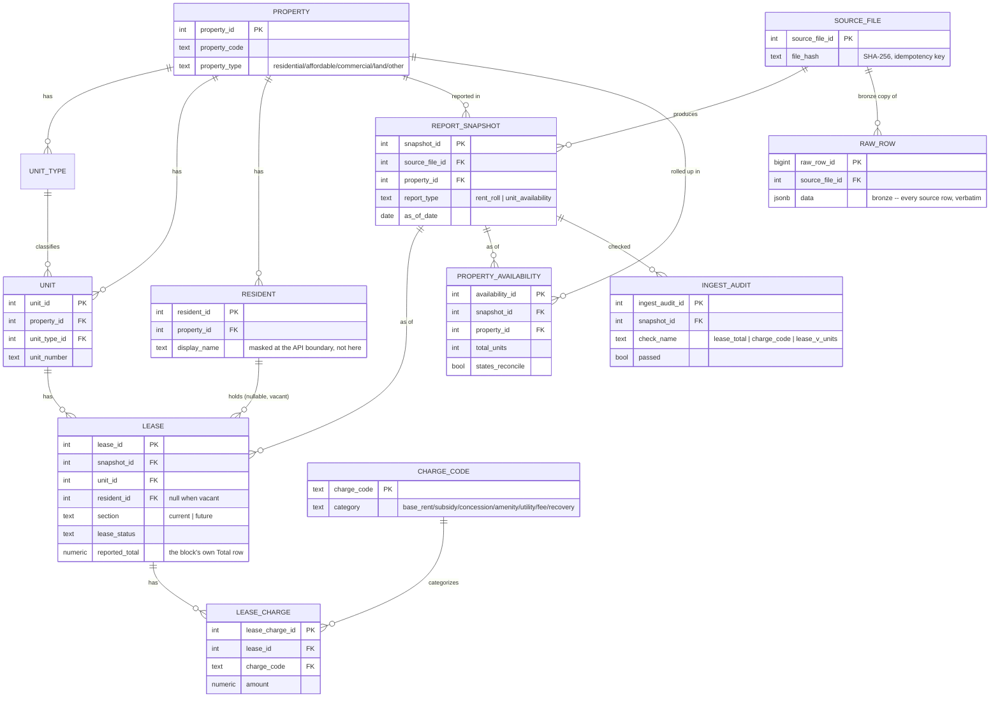

<!-- markdownlint-disable MD033 -->

# Rent Roll Intelligence

A take-home case study for an AI & Software Engineering internship at a
vertically integrated real-estate firm: turn 50 raw Yardi Voyager exports
(25 properties × Rent Roll with Lease Charges + Unit Availability, all as
of 2026-02-25) into a reconciled database, a read-only API, a dashboard,
and an LLM agent that can answer portfolio questions without ever
computing a number itself. The shape is a bronze/silver/gold ingest
pipeline feeding a FastAPI backend, a Next.js dashboard built as an
engineering drawing sheet (every figure ships with its source, its
snapshot, and its revision state), and a curated tool-use agent whose
every answer is checked against the data that actually backed it before
it's allowed to reach the reader. The "why" behind all of it is one
finding from the very first pass over the files: the portfolio is
genuinely mixed-use (residential, affordable, commercial, land,
management), and mixed-use data breaks naive assumptions in specific,
costly ways — a `WHERE charge_code = 'RENT'` filter silently zeroes five
commercial properties; an averaged portfolio occupancy percentage
blends a 775-unit complex with a 3-unit retail strip into a number that
means nothing. Everything here is built around not doing that.

---

## Quickstart

```bash
python -m venv .venv && source .venv/bin/activate && pip install -r requirements.txt
make up && make migrate && make load
make api                        # terminal 1 — :8000
make dashboard                  # terminal 2 — :3000
```

Needs a `.env` in the repo root (`DATABASE_URL`, `READONLY_DATABASE_URL`,
`MASK_PII=true`; add `ANTHROPIC_API_KEY` to use the agent — see
`CLAUDE.md` for the full variable list and `docker compose`'s devpass
default). Source files are gitignored and go in
`data/raw/{Rent_Roll_with_Lease_Charges,Unit_Availability}/`.

---

## Screenshots

**The portfolio sheet** — title block, 25-property schedule drawn to one
shared scale, occupancy segmented by type (never blended), expirations,
and every reconciliation deviation redlined in the margin before a
reader gets to the numbers:



**A property sheet, drilled into a commercial property (153c)** — the
derived-occupancy-source badge, and loss-to-lease rendered as a hatched
"not applicable" field rather than a blank or a zero, because commercial
properties don't have a market-rent baseline to measure against at all:



Both predate the command dock going live — the input at the bottom now
answers questions with live tool-call progress, inline citations, and a
resizable transcript instead of "toolbelt not connected." A screenshot
of that is the one piece of visual documentation still missing; see
`docs/agent.md` for what it actually does, or run it locally with the
example in that doc.

---

## Architecture

```
Excel files (50)
    |
    v  scripts/discover.py        structure validation, no DB writes
    v  ingest/parsers/            stateful row classifiers -> pydantic records
    v  ingest/loader.py           idempotent load + reconciliation
    |
Postgres    bronze (raw_row) -> silver (typed entities) -> gold (10 views)
    |
    v  api/            FastAPI, every response carries citations back to a snapshot
    v  agent/           curated tool-use agent -- tools call api/ over HTTP, not the DB
    v  dashboard-app/   Next.js, server components read api/ directly
    v  evals/           golden question set, tool-trajectory + semantic-accuracy scoring
```

Full write-ups: `docs/architecture.md` (schema decisions), `docs/api.md`
(endpoint catalogue), `docs/agent.md` (toolbelt, grounding, streaming),
`docs/dashboard.md` (pages, component vocabulary), `docs/data_quality.md`
(parser-facing detail on everything in the next section).

### ERD



Not pictured: `ingest_error` (parse/load failures, `source_file_id`
nullable FK) and `query_audit` (every `run_readonly_sql` attempt, no FK —
arbitrary SQL can touch anything). Ten gold views (plain, not
materialized) sit on top of this as the semantic layer the API,
dashboard, and agent all read: `v_latest_snapshot`, `v_lease_detail`,
`v_occupancy_by_property`, `v_loss_to_lease`, `v_delinquency_by_property`,
`v_charge_mix_by_property`, `v_expirations_by_month`,
`v_portfolio_summary_by_type`, `v_data_quality_summary`,
`v_portfolio_totals`.

---

## Data quality findings

**The mixed-use discovery.** Property codes carry a type suffix (`r` /
`a` / `c` / `land` / a bare management name) that turned out to encode
real structural differences, not just a naming convention. Commercial
properties have no `RENT` charge code at all — base rent is `RENTRETL`
or `RNTPROF` — so base rent resolves through `charge_code.category`
everywhere in this codebase, never a literal code match; a naive filter
zeroes five properties. Commercial properties also carry no `market_rent`
baseline, so loss-to-lease is genuinely undefined for them (rendered as a
hatched field, not a blank). Land and management entities have no leases
at all. None of this was a spec — it fell out of profiling all 50 files
before writing a single parser (`scripts/discover.py`).

**Reconciliation coverage.** Two tiers, per file. Primary: every lease
block's own `Total` row, reconciled against the sum of its charges —
**4,106 / 4,106 exact**, across all 25 files, to the cent. Secondary: a
file-level "Summary of Charges by Charge Code" block, present in only
16 of 25 files, cross-checked where it exists. A cross-report audit
independently compares each property's rent-roll lease count against the
availability report's `total_units`.

**Known limitations, surfaced not hidden** (`ingest_audit`/`ingest_error`
exist specifically so these are queryable, not buried in a log):

- **153c**: the availability report says `total_units = 0`; the rent roll
  has 7 current leases. Occupancy for 153c uses `rent_roll_derived` —
  the same fallback the API's `occupancy_source` field and the
  dashboard's badge exist to make visible on every affected property (7
  of 25, portfolio-wide).
- **462a**: the file's own charge summary is internally inconsistent —
  it reports `$30,963.00` for `SUBSIDY` and `$-30,963.00` for `SEC8CRD`,
  but the individual charges underneath sum to `$32,273.00` / `$-32,273.00`
  — off by `$1,310` on both, in opposite directions. The per-lease total
  for this file still reconciles exactly; only the file-level summary
  block is wrong. Per-lease sums are trusted, not the summary.
- **134c / 139c / 143c**: 3, 10, and 4 units respectively that the
  availability report doesn't classify into Occupied/Vacant/Notice at
  all — a residential-report-vocabulary gap on commercial files. Counted
  and surfaced (`unclassified_units`), never redistributed across states
  or silently dropped from a denominator.
- **A structural gap fixed this session, not a data gap**: both parsers
  read fixed column positions with no check against the file's actual
  header row — a shifted or renamed column would have loaded silently,
  wrong values in the wrong fields, and could in principle still pass
  Total-row reconciliation by coincidence. Every file in this portfolio
  is well-formed, so this never fired in practice — but a load-time
  header-shape check (`ingest/parsers/helpers.py::check_columns`) closes
  the gap for the next 50 files, not just these 50. See
  `docs/journal.md`, 2026-08-28.

---

## Design decisions, with trade-offs

**Snapshot grain, not SCD2.** Every fact hangs off `report_snapshot`
rather than tracking lease history across time. The exports carry no
lease identifier, so threading one lease across snapshots would mean
fuzzy-matching on `(unit, resident, move_in)` with no way to validate the
match — a real SCD2 needs a stable key the source doesn't give us. Cost:
this build cannot answer "how did this lease change over time" — only
"what did the portfolio look like at this snapshot." With the Yardi API
instead of static exports, true SCD2 would be the right call.

**Stateful row-classifier parsers, not a generic tabular loader.** The
rent roll isn't a table — a lease's first charge sits on the lease row
itself, and charge order varies (some leases lead with `PARKING`, not
`RENT`), so a generic `read_excel` + column-map approach would silently
drop or misattribute data. The cost is more parser code and a
closer coupling to this exact file format; the alternative (force it
into a generic shape) was tried conceptually and rejected because it
can't represent "a lease row that is also a charge row."

**Bronze layer (`raw_row`, full JSONB) kept even though nothing reads it
today.** The trade-off is real storage cost — 19,525 rows of duplicated
source data — for the ability to replay any parser change without
re-reading spreadsheets that may not be sitting on disk next time. Worth
it once; would reconsider at a much larger file count.

**Two-tier reconciliation, per-lease primary.** The file-level charge
summary only exists in 16 of 25 files and, per 462a, can itself be wrong
— it's a secondary cross-check, never the primary signal. Per-lease
totals cover all 25 files and localize a failure to one lease instead of
one file. The trade-off: this only catches internal inconsistency, not
whether the *source numbers themselves* are correct against some ground
truth outside the export — nothing in this pipeline can catch that.

**Agent tools call the HTTP API, not the database.** `agent/tools.py`
makes real HTTP calls to the running `api/` server rather than opening a
DB connection. This means the agent has zero new PII-handling code to
get right (masking already happens at the API boundary) and zero new SQL
surface beyond the existing guarded escape hatch — at the cost of an
HTTP round-trip per tool call and a hard runtime dependency on `make api`
being up, including for evals.

**Numeric grounding is a heuristic membership check, not a proof.**
`agent/grounding.py` verifies every number in a drafted answer appeared
*somewhere* in this turn's tool output; it fails closed
("I can't verify that figure from the data.") when it can't. It cannot
verify a number is the *semantically correct* one — a model that
hand-counts rows instead of reading a pre-aggregated field can still
land on a wrong total that happens to satisfy membership. Two
mitigations (excluding `*_id` fields from the grounded pool; a prompt
rule preferring pre-aggregated tools) narrow this, but the real answer to
"is this actually right" is the evals harness, which caught two more
grounding edge cases (accounting-notation negatives, invented
illustrative example numbers) on its first run — see `docs/journal.md`.
The alternative (a stronger formal check, or trusting the model's own
self-report) was rejected as either out of scope for the timeframe or
not actually safer.

**PII masked at the API/serialization boundary, not in storage.**
`resident.display_name` is stored unmasked; `MASK_PII=true` rewrites it
to `Resident #<id>` at response time (`api/envelope.py`). This keeps raw
data queryable and auditable internally while guaranteeing every
external surface (dashboard, agent) is masked by default — the trade-off
being that a misconfigured `MASK_PII=false` is a real exposure risk in a
way that masking-at-storage wouldn't be, since the safety is enforced at
the boundary, not in the data itself.

**SSE for agent streaming, not WebSockets or polling.** Progress events
only (`tool_start`/`tool_done`/`status`/`error`), never the answer text
token-by-token — the answer can still be discarded by grounding and
replaced with the fail-closed sentence, and showing text that might get
retracted a moment later is worse UX than a short wait. SSE over a plain
`fetch` body reader was enough for one-directional progress updates
without adding a WebSocket dependency; the trade-off is no bidirectional
channel if a future feature needed the client to interrupt an in-flight
turn.

---

## Evals

`evals/golden_set.py` — 13 questions, facts pulled live from the running
API while writing the set, not guessed. Two recorded metrics, both
scored automatically by `python -m evals.run` / `make eval`:

- **Tool trajectory** — exact-set match between the tools the agent
  actually called and the expected set per question.
- **Semantic response accuracy** — an LLM judge (`evals/judge.py`, forced
  tool-use for structured output) comparing the actual answer against a
  prose brief of what a correct answer must convey, tolerant of
  phrasing, strict on substance.

Last run: **13/13 semantic accuracy, 11/13 tool trajectory** (`evals/report.md`).
The two trajectory shortfalls are the agent reasonably calling one extra
tool — not bugs, just stricter than exact-set-equality scoring allows.
The harness found and fixed two real grounding bugs on its very first
run before that; see `docs/journal.md`, 2026-08-28. It's a single-sample
snapshot given the agent's non-determinism, not a stable score — see
"another week," below.

---

## What I'd do with another week

- **Multi-sample evals.** Run each golden question N times and report a
  pass *rate*. This session directly observed the same question calling
  different tools or landing on different phrasing run to run — a
  single-sample score is a snapshot, not evidence of stability.
- **Real tests.** Synthetic fixtures for the parsers (never the real
  files — they contain resident names, balances, move-in dates), parser
  unit tests, a loader integration test against a scratch database. The
  actual safety net right now is the reconciliation batch, which is real
  but not the same thing as tests that survive a refactor.
- **Dynamic, agent-authored charts.** A chart-spec tool the agent can
  invoke, pinned to a canvas, exported as PNG/CSV/PDF — the natural next
  step once the agent can already answer the question in words.
- **Multi-month snapshots.** The schema is already built for this
  (`report_snapshot` grain, idempotent load by file hash) but nothing
  has exercised it with a second month of files yet. Would want to see
  whether trend questions ("how has occupancy moved since January")
  surface new grounding or citation problems the single-snapshot agent
  never had to solve.
- **Named-tool `query_audit` rows.** Only the SQL escape hatch writes to
  `query_audit` today; the schema already has generic `tool_name`/
  `question` columns that could carry every named-tool call too, for a
  complete server-side audit trail instead of relying on the response's
  own `tool_calls` trace.
- **Align `scripts/discover.py`'s lease-count diagnostic** with the real
  parser's 153c fallback (`unit_type or resident`) — caught during the
  final audit; the diagnostic currently under-counts by exactly 7 for a
  reason that has nothing to do with the data.
